# PhilInBioMed presentation plots

## Heatmap of percent of sequenced cases per epidemiological week

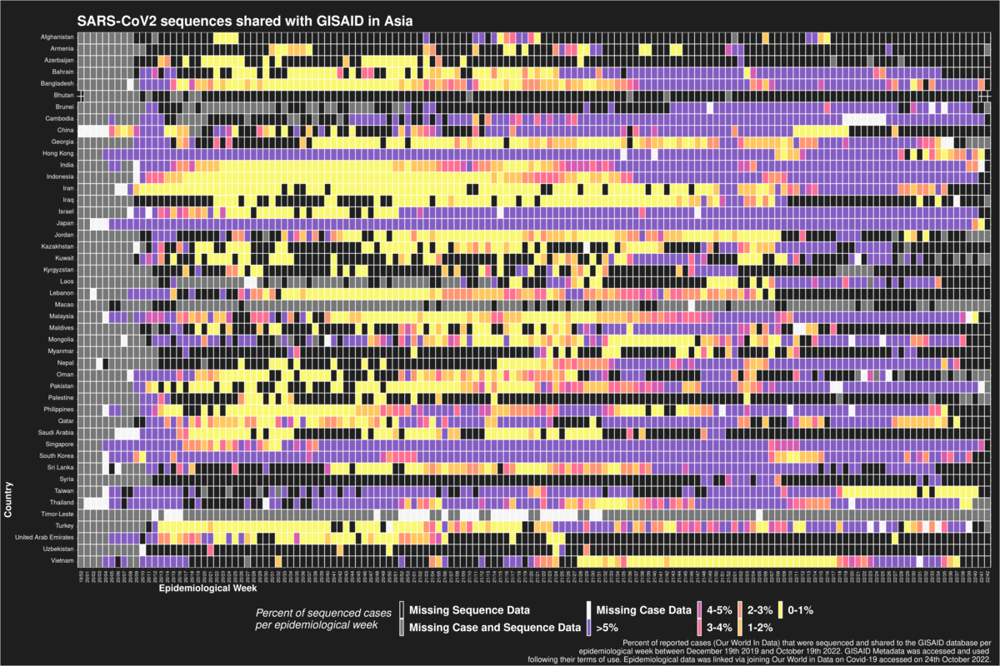
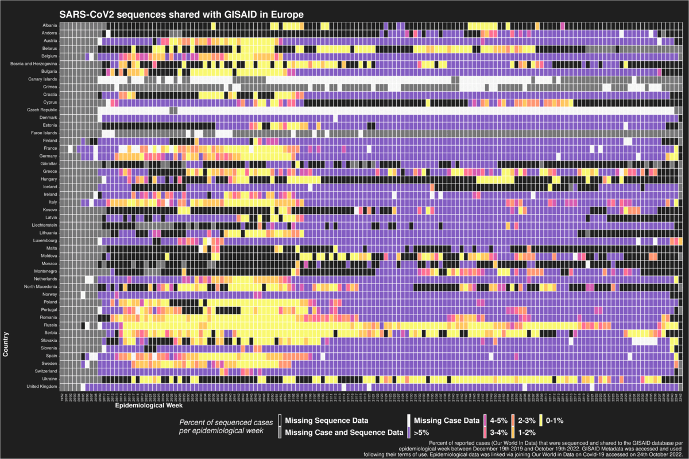
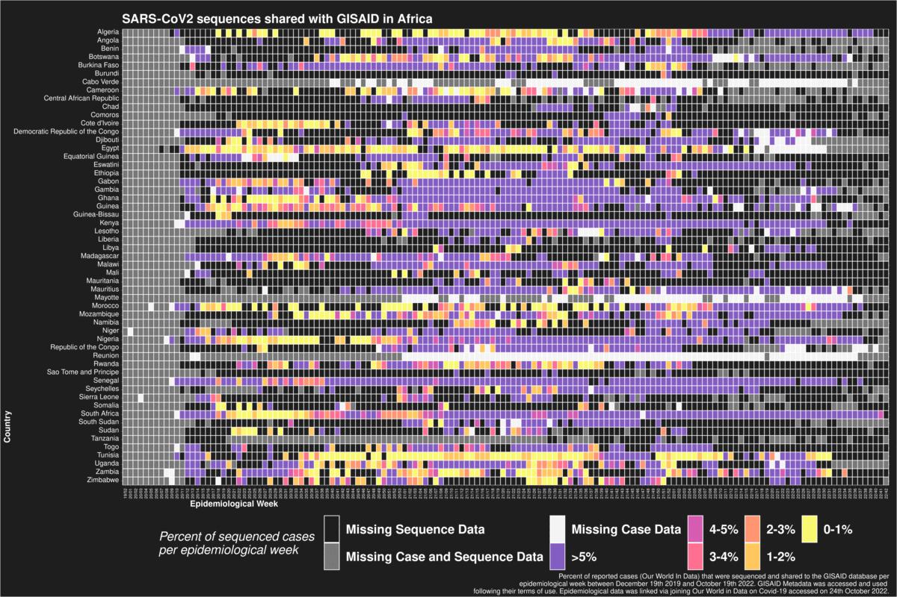
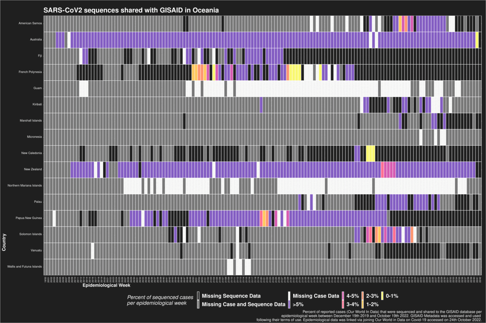

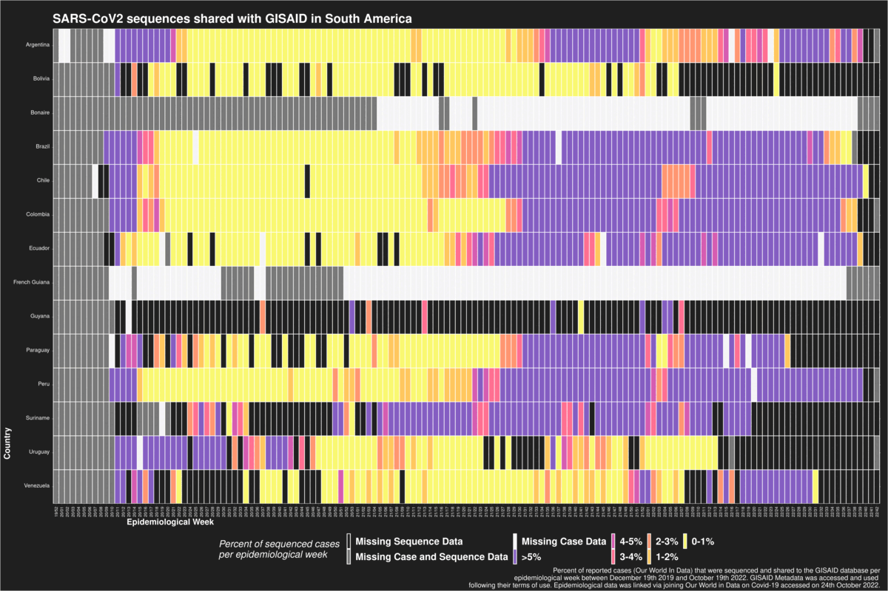

## Treemap of global share of sequences per data portal

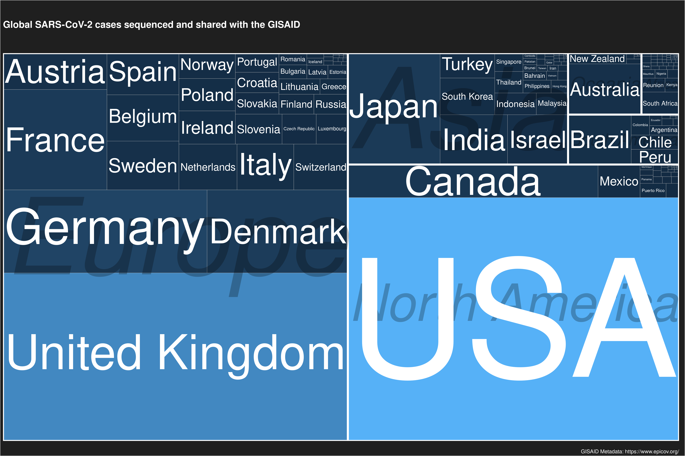
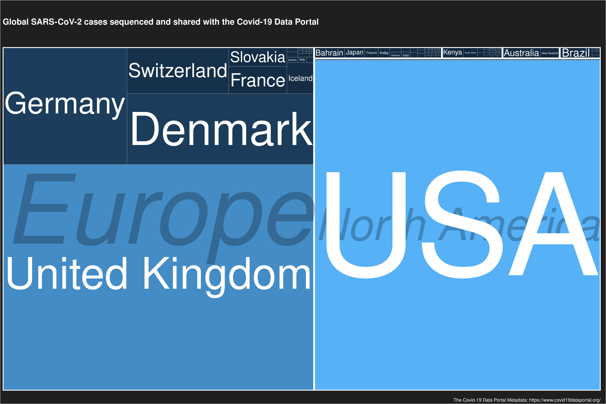
 
## Temporal submission per data portal

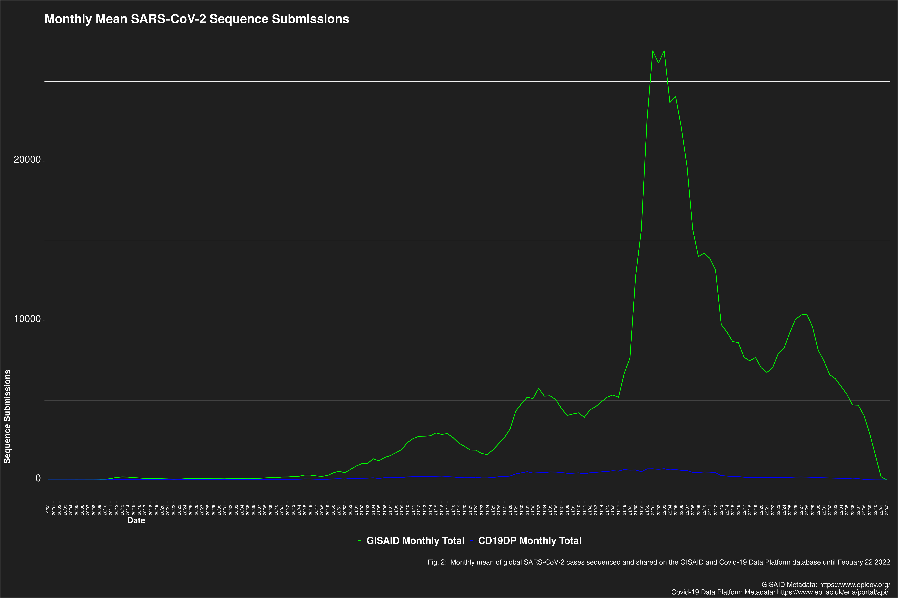
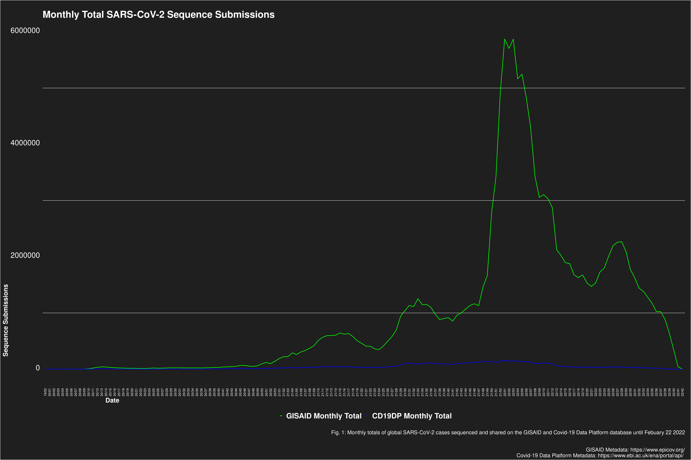
")
")

## Software dynamics

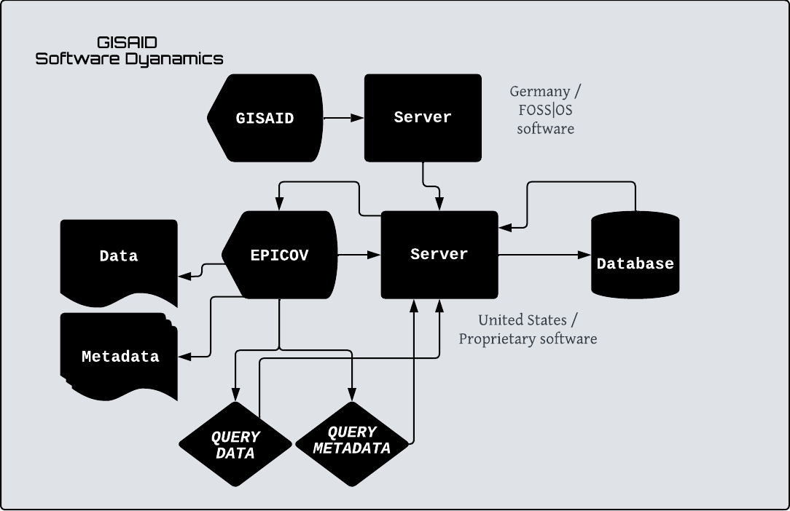
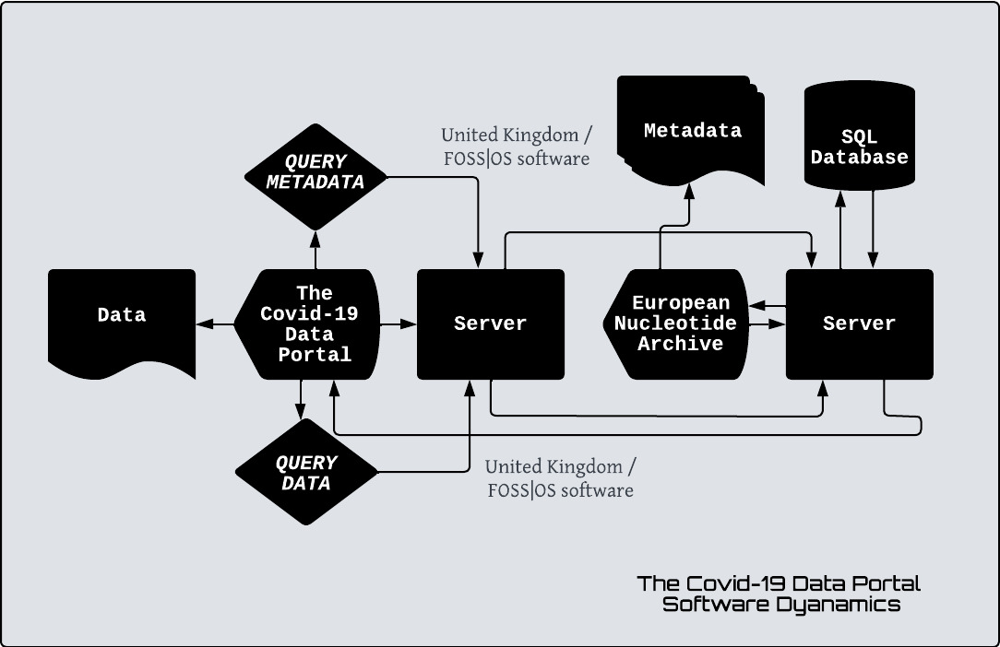

