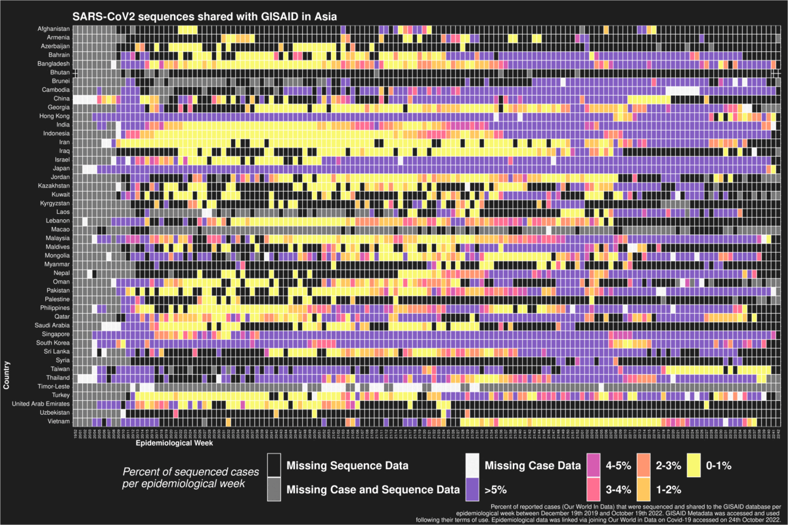
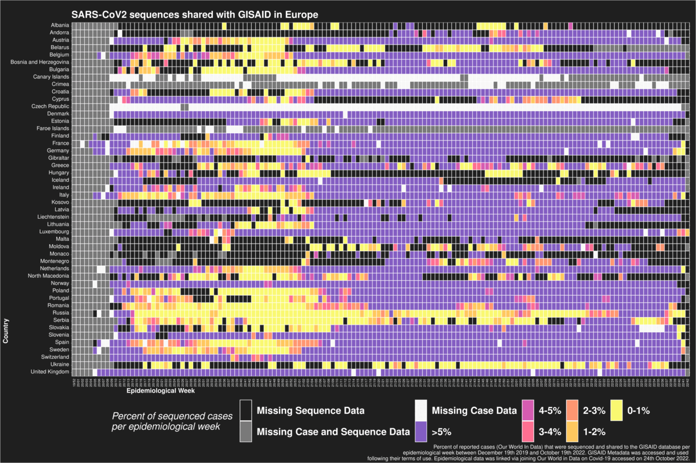
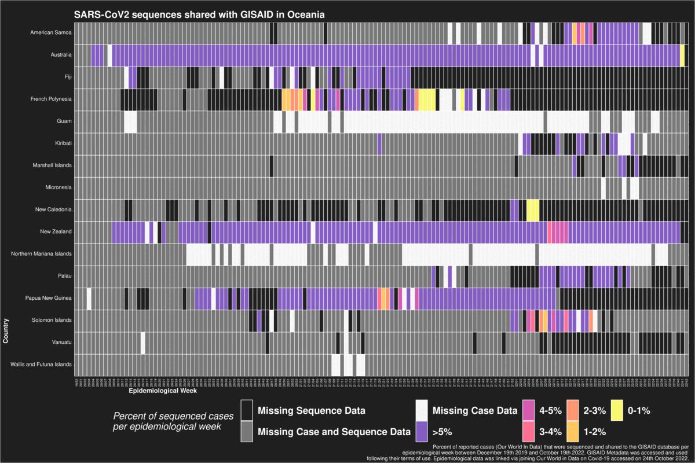
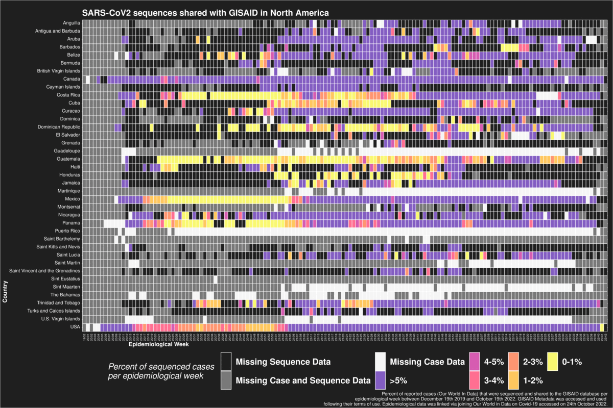
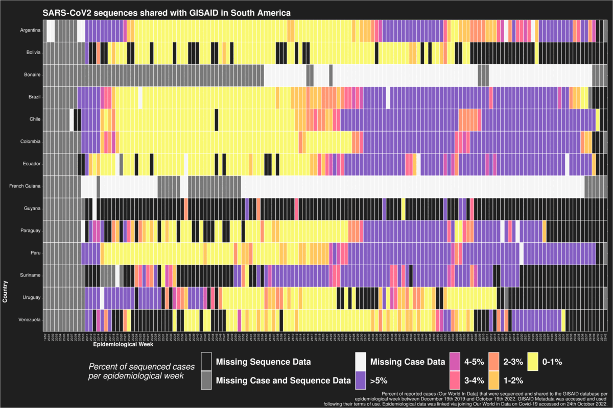
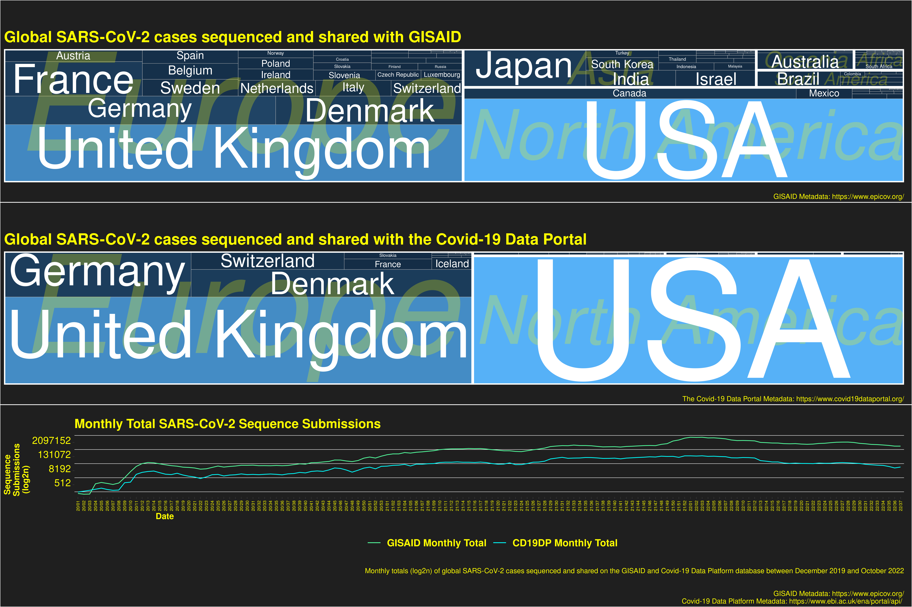
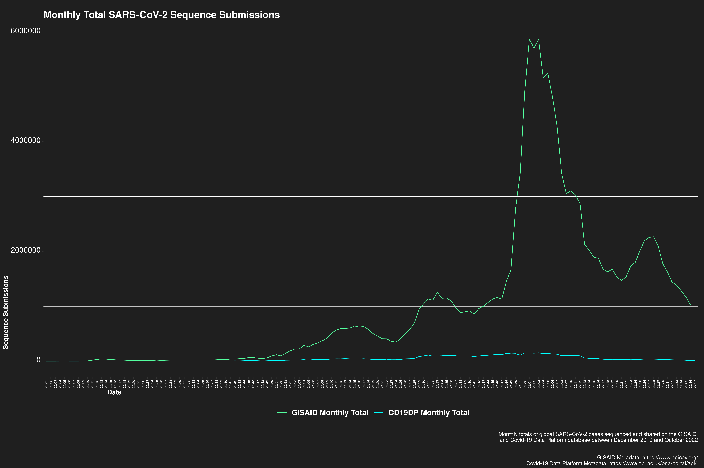
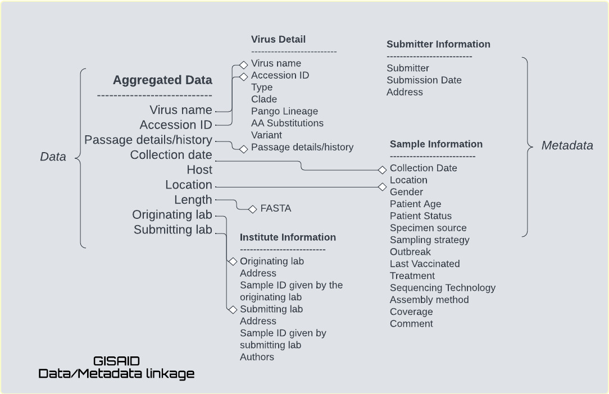
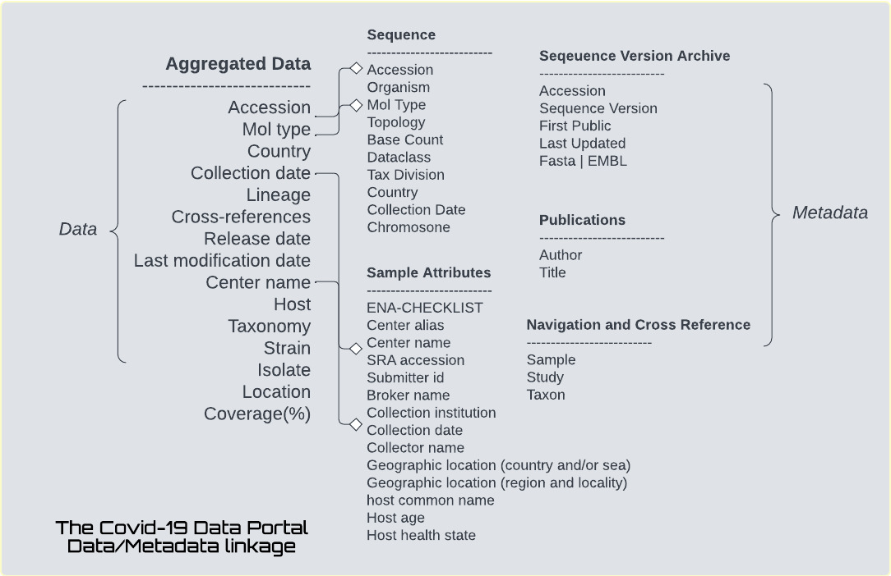

# PhilInBioMed presentation plots

## Heatmap of percent of sequenced cases per epidemiological week

## Treemap of global share of sequences per data portal

## Temporal submission per data portal

")
")

## Software dynamics

## Data and Metadata dynamics

