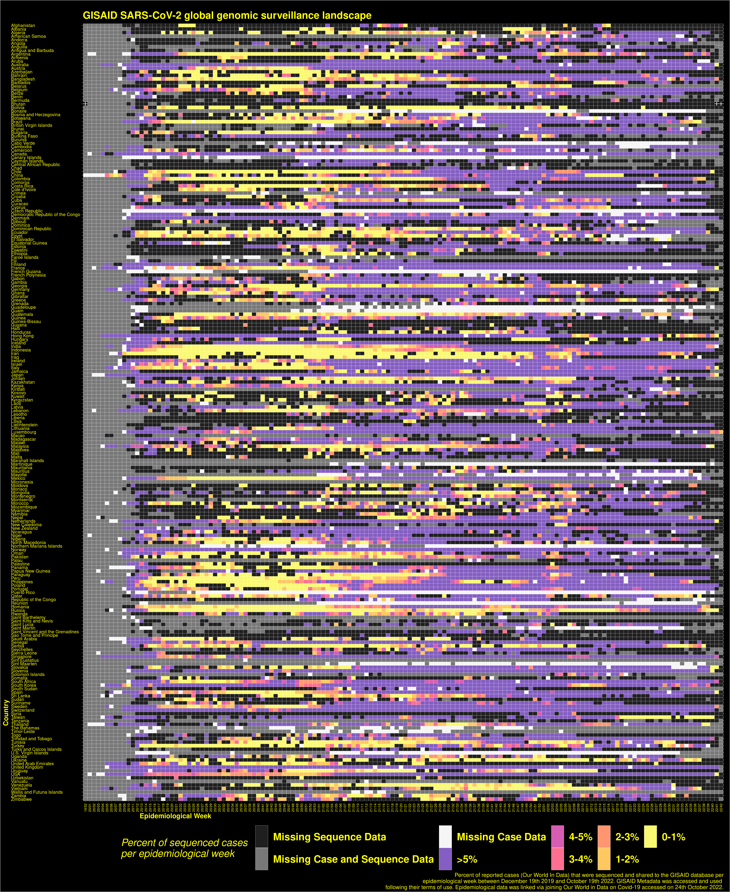

# Abstract
This paper discusses a tension between actionability and representativeness that is often found in data science initiatives within the biological and biomedical sciences. On the one hand, engaging in data sharing efforts only makes sense if data can be used to support discovery, thereby becoming ‘actionable’ – a consideration that leads some advocates of open data to argue that any constraint on data circulation constitutes an obstacle to knowledge production. On the other hand, making data actionable for knowledge development presupposes that the data are representative of the phenomena being studied. This in turn assumes that: (1) enough data are contributed by a wide and diverse set of relevant sources; and (2) mechanisms of feedback and inclusion are set up to ensure that data contributors can participate data governance and interpretation, thereby helping to adequately contextualise data. All too often, the requirements for actionability and representativeness of data are conceptualised as incompatible and leading to a trade-off situation where increasing one will unavoidably decrease the other. Through an analysis of two different platforms used to share genomic data about the SARS-COV-2 virus, we critique this framing as damaging to data initiatives and infrastructures. We argue that the tension between actionability and representativeness can be negotiated by a model of responsible data sharing that enhances users’ ability to work with data without sacrificing data protection measures and mechanisms of fair equitable governance, leading to an inclusive approach that maximises both representativeness and actionability. Crucially, such a model can only work when accepting that data do not need to be transparent, or even easily accessible, in order to be actionable; and that including a variety of contributors in efforts of data governance and interpretation may slow down the pace of discovery while boosting the robustness and quality of outputs. 

# Introduction

On the 29th of January 2021 the governing board of the European Bioinformatics Institute (EBI) posted a public letter in Nature calling for a greater “openness” in sharing SARS-CoV-2 genome data. The letter argued that “to unleash the fast flow of research advances” the scientific community must remove all formal barriers which restrict data sharing and share all SARS-CoV-2 genome sequences to one of a triad of state genomic surveillance programs (EBI, The GenBank of USA and the DNA Data Bank of Japan). The letter was signed and promoted by Nobel Laureates, Directors of Bioinformatic programs and many researchers at the cutting edge of genome sequencing. At the same time, the Global Initiative on Sharing Avian Influenza Data (GISAID) had just overtaken the EBI’s European COVID-19 Data Portal (C19DP) in the volume of genome sequences being shared to open access databases. GISAID was launched in 2008 to monitor global influenza outbreaks and from the offset positioned itself as an alternative to the public domain sharing model. Its policy requires users to authenticate their academic identity and agree not to republish or link GISAID genomes with other datasets without permission from the data producer. This requirement stems from the recognition that some researchers – often working in low-resourced environments and/or less visible research locations – are reluctant to share data due to fears of better-equipped researchers building on such work without due acknowledgment. Indeed, the GISAID model has fostered trust and information exchange among groups that differ considerably in their geo-political locations, funding levels, material resources and social characteristics, thereby expanding the range of data sources shared online. This proved decisive when, at the beginning of 2020, GISAID launched the EpiCov database which stores, analyses and builds evolutionary trees of SARS COV-2 genome sequences – now the leading open access database for SARS-CoV-2, with over 13 million genomes sequenced by November 2022. At the same time, limiting the extent to which data can be accessed and linked can negatively affect the insight, pace and breadth of future research – leading to the backlash by hundreds of leading researchers concerned about the urgency of an effective pandemic response.

This episode, and the ongoing debates underpinning the data sharing efforts by both GISAID and C19DP, signals a tension between actionability and representativeness that is often found in data science initiatives within the biological and biomedical sciences. On the one hand, engaging in data sharing efforts only makes sense if data can be used to support discovery, thereby becoming ‘actionable’ – a consideration that leads some advocates of open data, such as the signatories of the above-mentioned Nature letter, to argue that any constraint on data circulation constitutes an obstacle to knowledge production. On the other hand, making data actionable for knowledge development presupposes that the data are representative of the phenomena being studied. This in turn assumes that: (1) enough data are contributed by a wide and diverse set of relevant sources; and (2) mechanisms of feedback and inclusion are set up to ensure that data contributors can participate data governance and interpretation, thereby including domain/location-relevant expertise in specific instances data re-use, thus helping to adequately contextualise data. All too often, the requirements for actionability and representativeness of data are conceptualised as incompatible and as leading to a trade-off situation where increasing one will unavoidably decrease the other.

In what follows, we critique this framing and argue that the tension between actionability and representativeness can be negotiated by a model of responsible data sharing that enhances users’ ability to work with data without sacrificing data protection measures and mechanisms of fair governance, leading to an inclusive approach that maximises both representativeness and actionability. Crucially, such a model can only work when accepting that data do not need to be transparent, or even easily accessible, in order to be actionable; and that including a variety of contributors in efforts of data governance and interpretation may slow down the pace of discovery while boosting the robustness and quality of outputs.

To exemplify our argument, we focus on the ongoing efforts to share genomic data about SARS-COV-2 and compare the characteristics of the GISAID and C19DB platforms with respect to both their representativeness and actionability. We use data and metadata on genetic sequences posted on the two platforms in the period between March 2020 and October 2022, thus capturing the period of arguably most acute response to the COVID-19 pandemic. Through a variety of aggregation methods, we compare the extent to which the two portals succeeded in attracting data submissions from different countries around the globe, and look at the ways in which submission rates varied over time. We also analyse the structure and underlying architecture of the platforms, reviewing how they organise data access and use, the types of metadata and version tracking they provide, and the scope they offer for data re-use. We conclude that GISAID and C19DB are both carrying out an extraordinary public service, with much that can be learnt from each around how to maximise both the actionability and the representativeness of the data in question, with great benefit not only to ongoing research on the COVID-19 pandemic, but also to future pandemics for which reliable and responsive data infrastructures may be urgently required.

# Background

General background of urgent response requiring comprehensive and reliable data sources 

    push for Open Science initiatives, including OA and OD 

    immediate focus on virology and research on SARS-COV-2 variants (Dupré and Leonelli 2021). 

Genetic data are relatively easy to share from a technical perspective, given their digital format and the fact that current initiatives build on decades of efforts by molecular biologists and bioinformaticians towards the fast and free sharing of sequencing data (Leonelli and Ankeny 2012, Maxson-Jones et al 2018, Strasser 2019).

Among most successful initiatives is GISAID, the Global Global Initiative on Sharing Avian Influenza Data. GISAID was launched in 2008, on the anniversary of the Spanish influenza, to foster the sharing of influenza genomic data securely and responsibly. Data sharing was immediately conceptualised not as straightforward opening up of the data by placing them all online without restrictions, but rather as an alternative to the public sharing model, whereby users agree to authenticate their academic identity and not to republish or link GISAID genomes without permission from data producer. The existence of a governance structure regulating data access and re-use is meant to foster trust and information exchange among groups that differ considerably in their geo-political locations, funding levels, material resources and social characteristics, thereby expanding the range of data sources shared online.This model proved very successful in relation to influenza research, and since its launch GISAID plays an essential role in the sharing of data among the WHO Collaborating Centers and National Influenza Centers for the bi-annual influenza vaccine virus recommendations by the WHO Global Influenza Surveillance and Response System (GISRS). It is no surprise therefore that GISAID was swiftly redeployed, in early 2020, to include SARS-COV-2 data

EpiCov database stores, analyses and builds evolutionary trees of SARS COV-2 genome sequences. GISAID is now the leading open access database for SARS-CoV-2, over 13 million genomes sequenced by November 2022. It plays a key role in identifying and studying variants of interest, variant evolution and lineages, and spread in real-time; and indeed it features as key data provider for a wide variety of consortia, initiatives and projects devoted to the analysis of COVID-19 variants of interest (some of which listed on this page: https://gisaid.org/collaborations/enabled-by-hcov-19-data-from-gisaid/, many though not all funded and based in the Global North). Accordingly, GISAID is funded by a wide consortium of public and private bodies, including the Federal Republic of Germany, who first backed the project at its main site in XXXX, as well as public-health and academic institutions in Argentina, Brazil, China, Republic of the Congo, Ethiopia, Indonesia, Malaysia, Russia, Senegal, Singapore, South Africa and many other countries, as well as several donors and partners garnered under the label of “Friends of GISAID”.

In April 2020, the European Commission, through the auspices of EMBL and Elixir, launched another platform for sharing scientific – including genomic – information of relevance to the biological study of COVID-19: the COVID-19 Data Portal (C19DP). The portal’s motto is “accelerating research through data sharing” and its main strategy is to curate data to enhance interoperability across other platforms and enable bulk downloads of data with no user tracking, thereby encouraging linkage and cross-analysis with a wide variety of data types, including protein, expression, networks, imaging, even socio-economic data.

# The tensions between GISAID and COVID-19 Data Portal: a trade-off between actionability and representativeness?

It may be argued that, given their set-up and priorities, GISAID and C19DP have come to exemplify two different strategies in data sharing.

C19DP prioritises data actionability, defined as the capacity to re-purpose data for novel goals and research settings.1

GISAID prioritises data representativeness, defined as the extent to which the data garnered by the platform constitutes a comprehensive and credible sample of the populations under study.

Strong tension and perceived trade-off between representativeness and actionability of data

    GISAID: priority on enhancing comprehensiveness of coverage and accountability to sequence ‘donors’

    Science is not a level playing field + methodological cutting-edge does not necessarily support inclusion and trust

    need to ensure representativeness of data samples through appropriate data governance and tech choices

    C19DP: priority on making data “reusable”, rather than just accessible

    open data to unexpected re-purposing through interoperable standards/tools

This is by no means limited to this case. Efforts to apply data protection laws such as GDPR to datasets used for research have also encountered strong resistance, particularly in the form of concerns that limiting access and exploration of existing datasets would result in much diminished capacity to use those data as evidence to support novel insights and research directions. In the absence of a sophisticated governance structure, and the funding to maintain it, this has indeed come to pass: many research institutions (such as hospitals, for instance) have become more conservative over their data sharing policies, making it extremely hard for researchers to be granted access and virtually impossible to simply ‘explore’ the data without a precise and pre-existing commitment to specific forms of re-use. This is a problem particularly for exploratory research based on data mining techniques, where access to the data is seen as a foundational requirement to be able to ‘look around’ and fish for surprising findings, promising correlations, and new hypotheses.

An ongoing challenge, at once ethical and epistemic: Different interpretations of openness and responsible research.

# Comparing the two data infrastructures

We now compare the two data infrastructures on the basis of metadata acquired from the two portals between 2020 and 2022.

## Methods

*Global aggregations of Sequence and Epidemiological Data*

A recent surge of data science studies have started to explore the hetrogenitiy of the global genomic survlience landscape of the SARS-CoV-2 virus  (Khare .et al  2021, Samlali  2021, Brito .et al 2022,).However, to our knowledge, there has not been a explicit comparison between the GISAID database and its acclaimed foe the Covid-19 Data Portal. To fill this lacuna in the existing academic landscape, our analysis collected over 19 million data points for the respective databases between the epidemiological weeks of the 23rd of December 2019 and 1st of October 2021. Like the previously mentioned studies, we use epidemiological data from the COVID-19 Data Repository by the Center for Systems Science and Engineering (CSSE) at Johns Hopkins University (JHU) (https://github.com/CSSEGISandData/COVID-19) to report on global new case counts. The aforementioned data sources were linked together using country codes defined by ISO 3166-1 alpha-2. Percentages of Covid-19 cases sequenced per country - cumulatively and weekly - were calculated by filtering the data into weekly submissions and aggregating counts per country and continent; this was achieved using a custom R script (https://github.com/natesheehan/OPEN-GM/blob/main/code/data-wrangle.r). Visualisations were crafted together using the ggplot2 visualisation package and are made accessible via the following open access scripts (https://github.com/natesheehan/OPEN-GM/blob/main/code/plot-temporal-submissions.r, https://github.com/natesheehan/OPEN-GM/blob/main/code/plot-treemap.r and https://github.com/natesheehan/OPEN-GM/blob/main/code/plot-continent-landscape.r).

*TCP/IP stack fingerprinting*

TCP/IP stack fingerprinting (OS fingerprinting) is a function often used by hackers - ethical and not so ethical - to find out the characteistics of a system they may or may not have access too. As one author in the popular open source security package `nmap` puts it: "The legal ramifications of scanning networks with Nmap are complex and so controversial that third-party organizations have even printed T-shirts and bumper stickers promulgating opinions on the matter". OS fingerprinting works by remotely accessing a number of features in the TCP/IP stack implementation and comparing them to previosuly defined combinations of parameters to infer matches. For the purpose of this study, we deploy this function to uncover the various degrees of openness each database is designed with, as well as the various services and steps in place to access SARS-CoV-2 metadata. We use the open source `whatweb` command line tool to retrieve data concerning geographical location, author, type of server, and different types of plugins/libraries present in the system etc. The following command was used for each portal on the October 31st 2022. ```./whatweb -v https://www.dataportal-url.org -a 1```. Where -v gives a verbose output of the results and -a 1 represents a soft level of pen test. The complete output for each data portal can be found in the supplementary material.

*Data and Metadata mapping*

A snapshot of the current data to metadata mapping of variables is made 
Data and metadata made avaibale to download by each platform is further recorded in its 

Case studies 

We need to focus on two cases of use and supplement analysis with a look at who is behind these numbers: 

    Omicron: The variant was first detected through surveillance data coming from Botswana  

    Mu subvariant  

# Results

Analysis of the SARS-CoV-2 genome sequencing metadata revealed spatial and temporal heterogeneity across the two databases. Previous research has proposed that at least 5% of SARS-CoV2 positive cases should be sequenced in order to detect viral lineages at a prevalence of 0.1 to 1.0%. In our analysis of the GISAID database, 170 out of 218 countries had at one point exceeded the 5% threshold, with the most productive countries being Japan (95%), Australia (93%), United Kingdom (92%), Denmark (91%) and Canada (91%). In comparison, the Covid-19 Data portal showed that less than half of the sample countries had > 5% of confirmed cases sequenced, with the leading countries being United Kingdom (63.5%), Liechtenstein (62.8%), New Zealand (57.4%), Iceland (50%) and Bhutan (48.6%). Although the total number of cases were relatively similar between high-income and low/middle income countries, HICS submitted 10-fold more sequences per Covid-19 cases.

```{r, echo=FALSE, fig.cap="Global Landscape of SARS-COV-2 Genomic Survellance (GISAID)", out.width = '100%'}

```

```{r, echo=FALSE, out.width="49%", out.height="100%",fig.cap="",fig.show='hold',fig.align='center'}
knitr::include_graphics(c("../plots/presentation/gisaid-software.jpeg","../plots/presentation/gisaid-data-metadata.jpeg"))
```

A data user will most likely start their journey using the GISAID platform, hosted on highly secure and free/OS software in Germany. From here a data user will need to sign up for the EpiCov3 database which is the primary way to access GISAID data. The EpiCov3 database is hosted on highly secure, closed software in the United States. Aggregated data is summarised in nine columns which reference the three sub metadata categories. One important thing to notice here is the direct mapping between the data and metadata. In most cases, a column in the aggregated data will directly reference and match to a metadata sub category that will contain additional and often more private information. It should be noted that there also exists one isolated metadata category, which contains highly personal information regarding the submitter of the sequence

```{r, echo=FALSE, out.width="49%", out.height="100%",fig.cap="",fig.show='hold',fig.align='center'}
knitr::include_graphics(c("../plots/presentation/covid-19-data-portal-software.jpeg","../plots/presentation/covid-19-data-portal-data-metadata.jpeg"))
```

A data user will most likely start their journey using the Covid-19 Data portal, hosted on a fairly secure LAMP stack in the United Kingdom. From here a data user is able to use the data portal to openly query sequence data. However, when they do this request does not come from the Covid-19 Data Portals infrastructure itself, rather it queries the European Nucleotide Archive database and returns back aggregated data. In order to explore the metadata associated with a sequence, the data user will then be redirected to the ENA's app. An important thing to note here, is the dissonance between the aggregated data names and the associated metadata. While some common labels stay the same e.g. accession ID, many take new names after being pooled to the Covid-19 Data portal e.g. center name (data) -> collection institution (metadata). This linkage strategy blurs the direct matches and references between the data and the five metadata sub categories. This being said, two of the metadata categories hosted by the ENA contain linked if a sequence has been linked to a particular study, sample and taxon.
