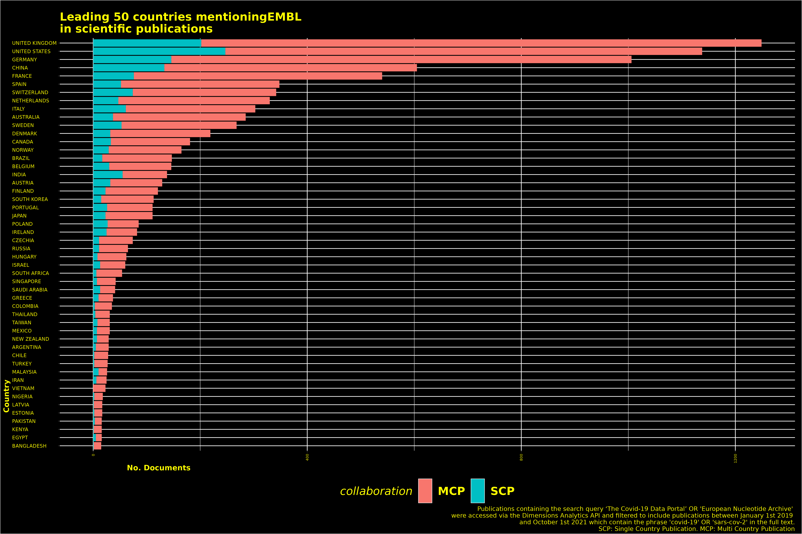

```{r pressure, echo=FALSE, fig.cap="Data Governance - Open Science - Covid-19 - Epistemic Diversity", out.width = '100%'}
knitr::include_graphics("../plots/dna.png")
```

<p style="text-align:center;font-size:3em;margin-bottom:-15vh"> <b>*</b></p>

<!-- GISAID is a global initiative that enables scientists to access genomic data of the SARS-CoV-2 virus. The platform has been praised for its efforts in enabling global collaboration, yet it has also come under fire for its strict open data policy which requires researchers to sign a data sharing agreement that limits how they can use and share this data.  -->


<!--  The covid-19 pandemic has highlighted the importance of open data sharing as it has allowed researchers to rapidly respond to the pandemic through rapid knowledge exchange.  -->

<!-- Open data is often described as a panacea for the problems of data sharing in science. Yet, its often generalised definition lacks  The two common strains of open data - gratis and libre - are often described as antithetical to one another. Gratis open data is defined as "open data that is free of charge" and libre open data is defined as "open data that is free of legal, technological or social restrictions" (OECD, 2015). 

In recent history the debate between gratis and libre open data has largely played out between GISAID and the Covid-19 data portal in publications, public letters and leaked emails, yet little work has been done to quantitatively study the effectiveness of each platforms open data policy. We aim to address this research gap by conducting a quantitative analysis of the two platforms with regards to their support for epistemic diversity. 

We operationalise epistemic diversity as the number of authors, institutions, ontologies and geographies that are represented in global publications that make use of data from either platform. Epistemic diversity is important because it allows for different forms of knowledge to be represented in scientific research. For example, geographical diversity is important because it allows for different forms of knowledge about the virus to be represented in scientific research. Similarly, disciplinary diversity is important because it allows for different forms of knowledge about the virus to be represented in scientific research. The debate between gratis and libre open data has largely played out between GISAID and the Covid-19 Data Portal. GISAID is a gratis open data platform that was launched in 2008 in response to the outbreak of the H1N1 pandemic. The platform was designed to allow scientists to share genomic data about emerging pathogens with one another. The platform requires users to sign a Data Use Agreement (DUA) which stipulates that users will not share the data with anyone who does not have a DUA. 

The Covid-19 Data Portal is a libre open data platform that was launched in 2020 in response to the outbreak of the SARS-CoV-2 pandemic. The platform was designed to allow scientists to share genomic data about the virus with one another. The platform does not require users to sign a DUA. 

The debate between the two platforms has largely played out in the form of publications, public letters and leaked emails. For example, in May 2020, GISAID released a statement which criticised the Covid-19 Data Portal for not requiring users to sign a DUA. The statement claimed that the lack of a DUA would lead to the misuse of data and would hamper efforts to track the spread of the virus. In response, the Covid-19 Data Portal released a statement which claimed that the DUA was unnecessary and that it would hamper efforts to track the spread of the virus. 

In September 2020, GISAID released an open letter which criticised the Covid-19 Data Portal for not requiring users to sign a DUA. The letter claimed that the lack of a DUA would lead to the misuse of data and would hamper efforts to track the spread of the virus. In response, the Covid-19 Data Portal released a statement which claimed that the DUA was unnecessary and that it would hamper efforts to track the spread of the virus. 

In October 2020, GISAID released an email which criticised the Covid-19 Data Portal for not requiring users to sign a DUA. The email claimed that the lack of a DUA would lead to the misuse of data and would hamper efforts to track the spread of the virus. In response,  -->

# Abstract

## Background

Open data too has undergone a pandemic. The two common strains of open data - gratis or libre - are often described as antithetical to one another. Such a framing of open data has caused a fierce demarcation debate on what constitutes as responsible data sharing during a time of emergency science. This debate has largely played out between GISAID and the Covid-19 data portal in publications, public letters and leaked emails, yet little work has been done to quantitatively study the effectiveness of each platforms open data policy.  We aim to address this research gap by conducting a quantitative analysis of the two platforms with regards to their support for epistemic diversity. We operationalise epistemic diversity as the number of authors, institutions, ontologies and geographies that are represented in global publications that make use of data from either platform. 

## Methods

20,955 publications (11,256 for GISAID and 9,699 for the Covid-19 Data portal) were accessed from the dimensions analytics api between between January 2020 and October 2022. The returned data underwent a scientific mapping using bibliographic methods from the `biblometrix` R package, including: general summary statistics, collaboration networks (authors, institutions, countries), co-citation Networks (authors, references, journals), coupling networks (references,authors,sources,countries), co-occurrences networks (authors,journal,keyword,title,abstract). Using data generated from the networks, we perform a series of correlation tests to investigate the spatio-temporal heterogeneity in global scientific production of publications and submissions to SARS-CoV-2 genomic surveillance data portals.

## Results

Our results show that there is a significant difference in the way gratis and libre open data platforms support epistemic diversity. Gratis open data platforms such as GISAID are more likely to support forms of epistemic diversity that are based on geographical location and institutional affiliation. In contrast, libre open data platforms such as the Covid-19 Data Portal are more likely to support forms of epistemic diversity that are based on disciplinary expertise and research methods.

## Conclusion
We conclude that the two strains of open data are not antithetical to one another, but complementary. We show that the two strains of open data have produced different forms of epistemic diversity through global publications and recommend 

> Supplementary material - including code, data and presentations - can be accessed through the papers github [repository](https://github.com/natesheehan/OPEN-GM/). 

<p style="text-align:center;font-size:3em"> <b>*</b></p>


# Diverse enough: A scientific mapping of sars-cov-2 genome databases 

## Background

Open Data is often lumped into two categories: "gratis" or "libre". These two terms have famously defined a period of open source history where computer scientists fought over the semantic import of describing technical processes and artefacts. As the quote famously goes "free as in speach, not beer" libre is Stallmans preposition in articulating the Free Software Movement (FOSS) and his position in defending freedom as a first principle in software and data exchange. 
#the semantic weighed with signifcant import - and for many still does. 

and computer scientists jousted with defining . Libre, coming from the latin word "free", is famously known to come from Richard Stiemns articulataion of the , where among his  

Altough these categories were intially developed to distingiush between the nuances of Open Access publications types, the terms have grown in the vernacular of data scholars and practitioners to taxonamise the various forms of OD. The terms are linguistically shared within the software movement 

The latent potential of Open Data (OD) to radically improve knowledge exchange came into momentous actualisation during the Covid-19 pandemic and now, more than ever, plays a critical role in the ways institutions, governments and businesses operate. Typically, when deciphering what socio-legal form OD is 

In his data driven history of bioinformatics, Hughes documents the long tradition and 


Like the literature in Open Access, the terms "gratis" and "libre" have been used to describe two key formulations of openness. For example, gratis, coming from the 

and the subsequent time passed since global sanctions and mandates were lifted in most countries. During this short but on going history, OD in its many forms and functions has come to play a commonplace role in the organisation of knowledge exchange among a global network of scientists, institutions, businesses and governments. This 

As Jamie Leach concludes the resilience across research communicates to effectively solve what ever may be virus X will fundamentally rely on the manifestation of open access, open data and open science  as "new normals", he write "anything less will be regression without justification". Leach is not alone, many others agree with his orientation that 

analysed using high-throughout put sequence machine in labatories spread across the globe. The field of genomic science and its cultural scientific norms of accepting the unrestricted sharing of genomic data 


<!-- oncludes, . While taken in its most utopian reading, Leach argument for Open Science, Open Data and Open Access etc missi   -->


What has been the debate between the two portals?

Nature letter
Gobels phd paper
Global disparities paper
Our previous work

How does this study fill the lacuna in research?

## Data and Methods

The following section outlines the data and methods used as an emperical tool in this investigation. Although one of the authors have aforementioned in previous work against one of the methodologies used in this paper - biblometric analysis (Leonelli REF) - a degree of explanation may be needed. 

### Data collection

Include queries, where teh data was from, what catefories were searched against, time, language, article type and manual filtering efforts. 

### Data Analysis

- Explain scientific mapping, Bibliometric analysis, regression and state all the software and packages being used.

- Summary statistics

- Networks of publications

- Spatio-temporal correlations

## Results

### GISAID

```{r, echo=FALSE, fig.cap="Data Governance - Open Science - Covid-19 - Epistemic Diversity", out.width = '100%'}
S = readRDS("../data/sum-ena-corpus.rds")
rmarkdown::paged_table(as.data.frame(S$MainInformationDF))
```

```{r, echo=FALSE, fig.cap="Data Governance - Open Science - Covid-19 - Epistemic Diversity", out.width = '100%'}

```


```{r, echo=FALSE, fig.cap="Data Governance - Open Science - Covid-19 - Epistemic Diversity", out.width = '100%'}
knitr::include_graphics("../plots/presentation/gisaid-networks.png")
```

### The Covid-19 Data Portal

#### Summary Statistics

```{r, echo=FALSE, fig.cap="Data Governance - Open Science - Covid-19 - Epistemic Diversity", out.width = '100%'}
S = readRDS("../data/sum-ena-corpus.rds")
rmarkdown::paged_table(as.data.frame(S$MainInformationDF))
```

#### Networks 

```{r, echo=FALSE, fig.cap="Data Governance - Open Science - Covid-19 - Epistemic Diversity", out.width = '100%'}

```


```{r, echo=FALSE, fig.cap="Data Governance - Open Science - Covid-19 - Epistemic Diversity", out.width = '100%'}

```


```{r, echo=FALSE, fig.cap="Data Governance - Open Science - Covid-19 - Epistemic Diversity", out.width = '100%'}

```


```{r, echo=FALSE, fig.cap="Data Governance - Open Science - Covid-19 - Epistemic Diversity", out.width = '100%'}

```


```{r, echo=FALSE, fig.cap="Data Governance - Open Science - Covid-19 - Epistemic Diversity", out.width = '100%'}

```


## Discussion

One could say there are two main arguments for epistemic diversity; one is practical and the other is normative. The practical argument for epistemic diversity rests on the idea that diverse perspectives lead to new insights and theories. This argument has been put forward by many social epistemologists, including Helen Longino (2002) and Evelyn Fox Keller (1985). Longino argues that epistemic diversity is important because it leads to “the cognitive benefits of confrontation with alternative points of view” (2002, p. 74). In other words, when different perspectives are brought into contact with each other, they can challenge and improve each other. This process of confrontation and exchange is essential for scientific progress. Keller makes a similar point when she argues that “diversity…is an indispensable condition of fruitful scientific research” (1985, p. 21). She goes on to say that “without…diversity…there could be no growth in our knowledge” (1985, p. 21). Thus, according to the practical argument, epistemic diversity is important because it leads to better science. On the other hand, the normative argument for epistemic diversity rests on the idea that diverse perspectives should be included in science for moral or political reasons. This argument has been put forward by many feminist philosophers of science, including Sandra Harding (1986) and Donna Haraway (1991). Harding argues that we should strive for an “optimal mix” of voices in science because this would lead to “a more just society”. These arguments are not mutually exclusive, and both can be used to support the case for epistemic diversity.

The theme of epistemic diveristy has been explored in Open Science initiatives by identifying the number of factors in which can shape a diverse Open Science project. These include, but are not limited to a diversification of methods, characteristics of researchers, funding, geo-political location and intellectual property regimes (Leonelli 2021).

## Conclusion
law enforcment, millatary gain, 
## References

<!-- Throughout the Covid-19 pandemic, genomic science was lauded as pursuing a utopian vision of global scientific co-ordination and collaboration in order to discover solutions for vaccines, hospital protocols and study the pathogen genetic mutations which shook the world. While in many ways, the increased volume, velocity and variety of genomic data sharing that happened in the height of the pandemic did indeed enable a fast track to SARS-Cov-2 solutionism, it is difficult to untangle the fields historical - and present - associations with both European and North American imperialism. Imperialist practices in genomic science embrace socio-scientifc paternalism, the invisibility of labour through the means of technology, and the dissonance among previously colonised countries and their colonising counterparts. Such issues affect the vernacularisation of genomic science, the translation of data into knowledge and the way in which technology is deployed. The way in which genomic data is governed during a pandemic can have profound implications for how the science is used, and by whom. 


The SARS-CoV-2 pandemic has seen a dramatic increase in the use of genomic data, with initiatives such as the Global Initiative on Sharing All Influenza Data (GISAID) and the Covid-19 Data Portal being among the leading in facilitating open sharing of all kinds; sequence, patient metadata records ,photogenic trees, literature and much more*. Despite this seemingly aulurtistic image of science, there has been an on going debate questioning if these increased sharing may not be inclusive or diverse enough, and that existing inequalities among global scientific networks may be exacerbated. Following on from this line of inquiry, -->
